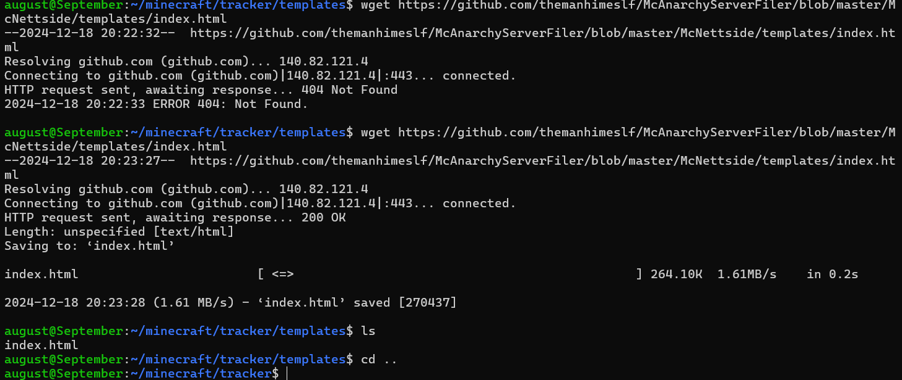

Dokumentasjon av terminoppgaven.

10/14-15
Først lagde jeg en mappe, MCfiler og koblet den til github og kommer til å bruke den
for meste av koden, nettside og plugins.

15-15
Igår installerte jeg linux OS på en SD kort til raspberry pi så jeg må la det installere før jeg kan begynne på minecraft serveren, men i mellom tiden kan jeg jobbe
på nettsiden ivertfall.

Raspberry PI OS LINUX, SYSADMIN 5 INFO
---------------------------
Navn: August
PC navn: September
Username: august
Passord: Natten
21st night of september
----------------------------
Update cmnds for terminal

$ sudo apt update

$ sudo apt upgrade
($ sudo apt full-upgrade)
-------

--- LOGG ---

16-16
Installerte linux OS på nytt til raspbery pi til å bytte passord (tror ikke det er en vei inne i den ifra det jeg fant ut av ivertfall) så nå må jeg egentelig bare
installere alt for en minecraft server så tror jeg burde få den gående innenfor denne eller neste uke

16-17 
tenker å sette opp minecraft server først, teste at den fungerer, så nettside og player count tracker (hadde ikke nok tid 11-12)

11-11
Har glemt passordet til Pi, despair, må bruke Raspberry Pi Imager/manager til å "resette" og gi den OS igjen.

11-12 
Putter in ny OS. Setter det opp, bruker, oppdatere alt etc

    11:27 
    Må installerer Java og minecraft server.

    1:13 pm
    Installerte Minecraft server og java, men CMD sier at java ikke funker/ installert
    måtte installere java fra CMD med "sudo apt install openjdk-17-jre"  det funket ikke siden '17' er 1.18 og under og '23' er for den relative nye MC versjonen jeg brukre
   ' 1.21.3 '