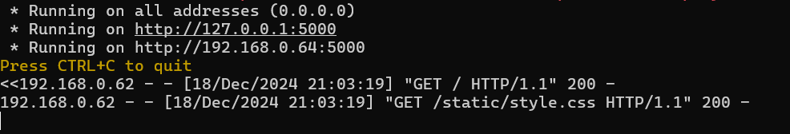

Dokumentasjon av terminoppgaven.

Forord
--
Denne dokumentasjon har ikke med seg alt av stegene jeg gjorde men en del av viktige ting som har skjedd, konkulasjoner og annet som er viktig til dette.

10/14-15
lagde jeg en mappe, MCfiler og koblet den til github for lagring/backup


# Raspberry Pi Setup/Info
  - [Raspberry Pi Info](#raspberry-pi-info)             
  - [MariaDB Info](#mariadb-info)   
  - [Endringer](#endringer-i-beggeenhver)
  - [MariaDB Commands](#mariadb-commands-SQL)

  # Minecraft Setup

  - [6. Minecraft veiledning](#6-minecraft)

  - [6.1 Minecraft JAVA](#6.1-Minecraft-server-JAVA)

  - [6.2 Minecraft Spigot](#6.2-Minecraft-server-SPIGOT/BUILDTOOLS)

  - [6.3 Minecraft tracker Java](#6.3-Player-tracker-JAVA)


## Raspberry Pi Info

Navn: August

PC navn: September

Username: august

Passord: Natten

21st night of september

## MariaDB Info

root Pass: Natten

User pass; Batman

## Endringer i begge/enhver
installerte pip/python

flask

Ingen anonymouse users, remote login not changed
fjernet test database

## MariaDB commands SQL
Vis databases
    
    SHOW DATABASES;

Lag databaser 
s
```javascript
console.log("Hello, world!");
```

    CREATE DATABASE database_name;
drop/slett databaser 
  
    DROP DATABASE database_name;
bruk Database 
    USE database_name;


## 6. Minecraft
Guide til å sette opp alt igjen hvis ting blir bricked

Ubuntu OS RPi 4b 8GB 32GB 
Either SSH or do it manually/copy paste into terminal 

Notater/Prerequisities:

    VIKTIG
    Installer riktig/den versjonen av java for den versjonen av minecraft du vil ha
        sudo apt install openjdk-VERSJON-jre 
    
    For connection
        Sudo ufw enable
        Sudo ufw allow 22/tcp
        Sudo ufw allow 25565/tcp 
    
    VIKTIG
    Lag en mappe f.eks "minecraft" og put filene til serveren oppi der/cd inn dit (trenger ikke bare nyttig)

---
## 6.1 Minecraft server JAVA
    Ha installert java

1. Create a directory/folder for your minecraft server (trenger ikke bare nyttig)

        mkdir ~/minecraft
        cd ~/minecraft
2. Install minecraft server and move it to the minecraft directory/folder or use 'wget' og link in minecraft server directory

3. Edit the Eula.txt to say true and update any server.properties you want or use nano to adjust settings like gamemode, difficulty.

4. -Xmx, -Xms to adjust amount of ram. and start the server. (fjern nogui for gui)

        java -Xmx1024M -Xms1024M -jar server.jar nogui


## 6.2 Minecraft server SPIGOT/BUILDTOOLS
Ha installert java og Git eventuelt
    1. installer nyeste "BuildTools.jar" fra nettside eller med 'wget'

2. så CD in i mappa "minecraft" f.eks. og run denne

        java -jar BuildTools.jar
3.  nogui = ingen grafisk interface fjern eller ha hvis du vill Xmx2g for hvor mye ram, xms for start ram

            java -Xmx2G -Xms1G -jar "navn til serveren.jar" nogui
    (du kan bytte navne til serveren med 'mv spigot-"" server.jar')
    

Viktig: Sa det før men sier det igjen, å sette opp en minecraft server er lett, men bare at jeg gjør det for første gang og vil bare gjøre alt rett.


## Gammelt
Intro: dette et enten ting som er gammelt eller ikke trengs men likavel her for dokumentasjon

## 6.3 Player tracker JAVA

    ---MINETRACK----
    https://github.com/Cryptkeeper/Minetrack
        you need Node.Js for this you can install it using:
        1.  sudo apt update
        sudo apt install nodejs npm

    Clone the Minetrack repository from GitHub:
        2.  git clone https://github.com/Cryptkeeper/Minetrack.git
            cd Minetrack

    Install the required dependencies:
        3.  npm install
            Configure Minetrack: Edit the config.json file to customize settings such as server IP, port, and update speed.

    Run Minetrack: Start the Minetrack server:
        4.  node main.js

    Open your web browser and go to http://<your-server-ip>:8080 to view the player counter and other statistics.

    ---SERVERSTATS---

    Follow the installation instructions on this github page.
    https://github.com/diced/ServerStats

    Customize the settings to match your server's requirements.

    Open your web browser and go to the provided URL to view the player counter and other statistics.

    --VIS PÅ NETTSIDE

        Use a script to fetch the player count data from Minetrack or ServerStats. (press the github/yt for whatever you chose)

        Use HTML and JavaScript to show the player count on your website.

        https://www.youtube.com/watch?v=Zjt0p7VoP3E
        https://github.com/leonardosnt/mc-player-counter


------ LOGG ---------
------------


Installerte OS til SD korte til Raspberry Pi.
Måtte gjøre det igjen pga glemt passord/noe gikk feil.

16/17 

tenker å sette opp minecraft server først, teste at den fungerer, så gjøre alt annet (hadde ikke nok tid)

11/12
Har glemt passordet til Pi, må bruke Raspberry Pi Imager/manager til å "resette" og gi den OS igjen.


Putter in ny OS. Setter det opp, bruker, oppdatere alt etc

   
    Må installerer Java og minecraft server.

    Installerte Minecraft server og java, men CMD sier at java ikke funker/ installert
    måtte installere java fra CMD med "sudo apt install openjdk-17-jre"  det funket ikke siden '17' er 1.18 og under og '23' er for den relative nye MC versjonen jeg brukre' 1.21.3 '
   
  Det funket ikke.

  Prøver å bare installere alle java versionene '17,21,22,23'
  Funket ikke heller
  
  Installerer OS på nytt, greia er for clouded med alt nå skal finne noe som viser hvordan man kommer fram til det
 
  OS er installert bruker satt opp, Den bare laster akuratt nå.

11/13

Er fortsatt usikker hvorfor det ikke fungerer tror det er pga man må gjøre mye mere i cmd men har ikke en konkret guide endå

Nå sjekker jeg for om Raspberry Pi 4 har minimun "requirements" til å hoste en server
basically om raspberry pi sin '1,5 Hz Quad Core-prosessor' er på/nærme nivå som 'Intel Core 2 Duo eller AMD Athlon 64 x2' begge er rundt 1.5ghz 

nå som jeg ser det "https://minecraft.fandom.com/wiki/Server/Requirements" det er for windows men for linux "https://minecraft.fandom.com/wiki/Server/Requirements/Dedicated#Unix_(Linux,_BSD,_macOS)" så er den på nesten lik som 'Minimum og Acceptable'.

Så etter å ha sammenlingt dem går det mest sikkert må bare finne riktig prosess sikkert enklere en jeg tror eller finner

Greide det, alt fungerer som det skal, Kommandoer, spill, og annet.
 
  nå for å bare customize, Adde plugins, sette opp nettside og alt annet litt usikkre på om plugins funker på java server som jeg har


11/14
lagde en bash script til å starte serveren med "./start.sh"


Prøver å finne ut om jeg må og om jeg trenger å installere og bruke spigot istedet

og jeg må prøve å finne ut hvordan få en dns for serveren istede for å skrive inn ip  

har også laget en ny fil.md for scripts som jeg kommer til å bruke


11/15
Installerer og prøver å starte en server med spigot


Funket ikke 10:50 
skal full resette Pi og prøve på nytt pga tror noe er korrupt men usikker

har greid å lage java server tror prinsippet er det samme
bare fucket opp et sted

Var syk noen dager, har begynt på igjen, tenker å starte på nettside.

12/3
Har startet med nettside usikker på om jeg har tid til å 
gjøre den ferdig til å lage en DB neste uke


12/10

Setter opp MariaDB på raspberry PI, 
men når jeg installerer flask går noe feil


