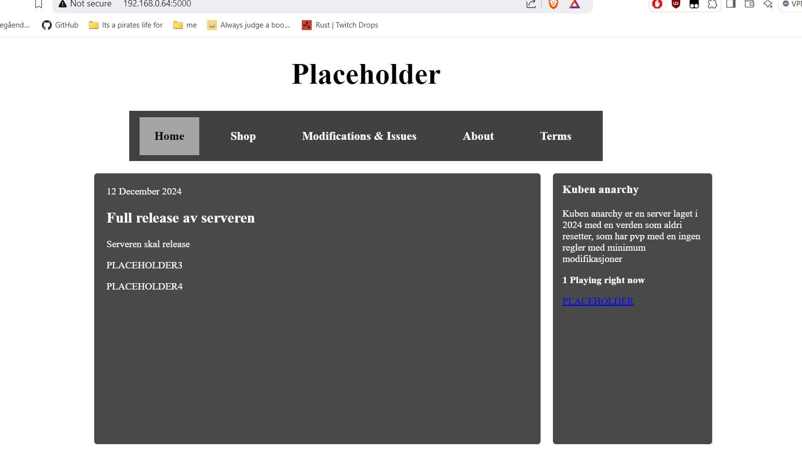

Dokumentasjon av terminoppgaven.

Forord
--
Denne dokumentasjon har ikke med seg alt av stegene jeg gjorde men en del av viktige ting som har skjedd, konkulasjoner og annet som er viktig til dette.

10/14-15
lagde jeg en mappe, MCfiler og koblet den til github for lagring/backup

------ LOGG ---------
------------

Installerte OS til SD korte til Raspberry Pi.
Måtte gjøre det igjen pga glemt passord/noe gikk feil.

16/17 

tenker å sette opp minecraft server først, teste at den fungerer, så gjøre alt annet (hadde ikke nok tid)

11/12
Har glemt passordet til Pi, må bruke Raspberry Pi Imager/manager til å "resette" og gi den OS igjen.

Putter in ny OS. Setter det opp, bruker, oppdatere alt etc

   
    Må installerer Java og minecraft server.

    Installerte Minecraft server og java, men CMD sier at java ikke funker/ installert
    måtte installere java fra CMD med "sudo apt install openjdk-17-jre"  det funket ikke siden '17' er 1.18 og under og '23' er for den relative nye MC versjonen jeg brukre' 1.21.3 '
   
  Det funket ikke.

  Prøver å bare installere alle java versionene '17,21,22,23'
  Funket ikke heller
  
  Installerer OS på nytt, greia er for clouded med alt nå skal finne noe som viser hvordan man kommer fram til det
 
  OS er installert bruker satt opp, Den bare laster akuratt nå.

11/13

Er fortsatt usikker hvorfor det ikke fungerer tror det er pga man må gjøre mye mere i cmd men har ikke en konkret guide endå

Nå sjekker jeg for om Raspberry Pi 4 har minimun "requirements" til å hoste en server
basically om raspberry pi sin '1,5 Hz Quad Core-prosessor' er på/nærme nivå som 'Intel Core 2 Duo eller AMD Athlon 64 x2' begge er rundt 1.5ghz 

nå som jeg ser det "https://minecraft.fandom.com/wiki/Server/Requirements" det er for windows men for linux "https://minecraft.fandom.com/wiki/Server/Requirements/Dedicated#Unix_(Linux,_BSD,_macOS)" så er den på nesten lik som 'Minimum og Acceptable'.

Så etter å ha sammenlingt dem går det mest sikkert må bare finne riktig prosess sikkert enklere en jeg tror eller finner

Greide det, alt fungerer som det skal, Kommandoer, spill, og annet.
 
  nå for å bare customize, Adde plugins, sette opp nettside og alt annet litt usikkre på om plugins funker på java server som jeg har

11/14
lagde en bash script til å starte serveren med "./start.sh"

Prøver å finne ut om jeg må og om jeg trenger å installere og bruke spigot istedet

og jeg må prøve å finne ut hvordan få en dns for serveren istede for å skrive inn ip  

har også laget en ny fil.md for scripts som jeg kommer til å bruke

11/15
Installerer og prøver å starte en server med spigot

Funket ikke 10:50 
skal full resette Pi og prøve på nytt pga tror noe er korrupt men usikker

har greid å lage java server tror prinsippet er det samme
bare fucket opp et sted

Var syk noen dager, har begynt på igjen, tenker å starte på nettside.

12/3
Har startet med nettside usikker på om jeg har tid til å 
gjøre den ferdig til å lage en DB neste uke

12/10

Setter opp MariaDB på raspberry PI, 
men når jeg installerer flask går noe feil

