Dokumentasjon av terminoppgaven.

Forord
--
Denne dokumentasjon har ikke med seg alt av stegene jeg gjorde men en del av viktige ting som har skjedd, konkulasjoner og annet som er viktig til dette.

lagde jeg en mappe, MCfiler og koblet den til github for lagring/backup
usikker på andre måter man kan ha backups
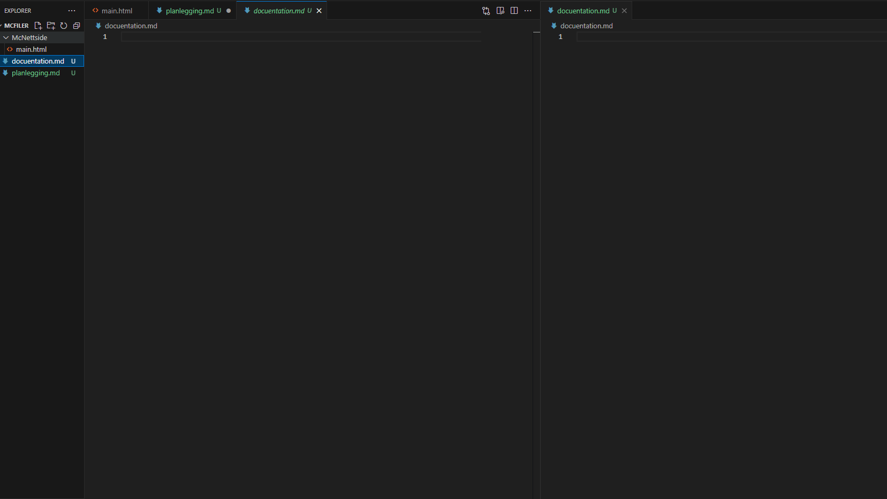

  - [Logg](#logg)

Prerequisities til å gjøre det igjen
---
  Installere Python/pip, mcstatus, flask

    sudo apt install -y python3 python3-pip
  For mcstatus og flask
    pip3 install mcstatus flask

  Installere riktig java versjon for minecraft

        sudo apt install openjdk-VERSJON-jdk/jre
  vanligste er 17,21 (jdk for dev, jre for ikke dev)
 
  For connection

        sudo ufw enable
        sudo ufw allow 22/tcp
        sudo ufw allow 25565/tcp 
    
  VIKTIG
  Lag en mappe f.eks "minecraft" og put filene til serveren oppi der/cd inn dit (trenger ikke bare nyttig)

 Raspberry Pi Setup/Info/Teknisk info
---

  - [Raspberry Pi Info](#raspberry-pi-info)             
  - [MariaDB Info](#mariadb-info)  
  - [Endringer](#endringer)
  - [MariaDB Commands](#mariadb-commands-SQL)

Minecraft Setup
---

  - [6. Minecraft veiledning](#6-minecraft)

  - [6.1 Minecraft JAVA](#6.1-Minecraft-server-JAVA)

  - [6.2 Minecraft tracker UNTESTED ](#6.2-Player-tracker-JAVA)

## Raspberry Pi Info
Har også finnet ut at raspberry pi 4 kan håndtere nyeste versjonen av minecraft med ca. 4-8+ spillere
den består/greier minimum kravene.
(yap om hvordan/hvorfor)

  jeg for om Raspberry Pi 4 har minimun "requirements" til å hoste en server
  basically om raspberry pi sin '1,5 Hz Quad Core-prosessor' er på/nærme nivå som 'Intel Core 2 Duo eller AMD Athlon 64 x2' begge er rundt 1.5ghz 
  hvis du ser på det "https://minecraft.fandom.com/wiki/Server/Requirements" det er for windows men for linux "https://minecraft.fandom.com/wiki/Server/Requirements/Dedicated#Unix_(Linux,_BSD,_macOS)" så er den på nesten lik som 'Minimum og Acceptable'.

Teknisk Info

Navn: August

PC navn: September

Username: august

Passord: Natten

ssh 10.2.3.82 

ssh 192.168.0.64 

21st night of september

## MariaDB Info 

  root Pass: Natten
  User pass; Batman

## Endringer
installerte pip/python, Apache2, kanskje ajax, mcstatus

Ingen anonymouse users, remote login not changed
fjernet test database

Måtte gjøre minecraft ledig for query til true og kanskje sette ip for dns?

Query = true

cd minecraft

python3 getplayer.py

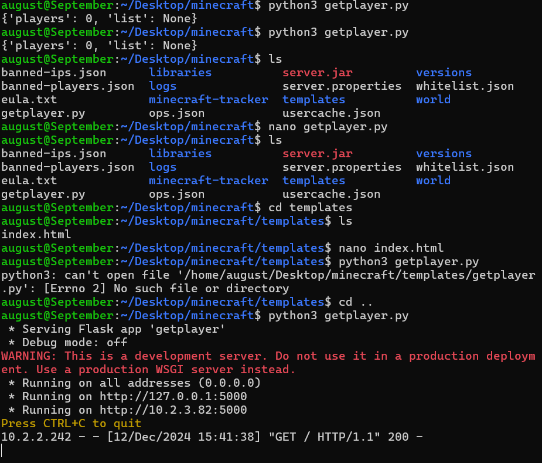

## MariaDB commands SQL
  - [Database Commands](#database-level-commands)
  - [Table Commands](#table-level-commands)
  - [Manipuler data](#manipuler-datagreier)
    - 
      - 

Relevant CMDS

Stop DB

    sudo systemctl stop mysql
Start DB

    sudo systemctl start mysql
Restart DB

sudo systemctl restart mysql

  ## Database-level commands
  Vis databases
    
    SHOW DATABASES;
  Lag databaser 

    CREATE DATABASE database_name;
  drop/slett databaser 

    DROP DATABASE database_name;
  bruk Database 

    USE database_name;

  ## Table-level commands

  Vis tables

    SHOW TABLES;
  Lag table

   CREATE TABLE table_name (
    column1 datatype,
    column2 datatype,
   );

  Forklar Table: 

    DESCRIBE table_name; 
  or 

    EXPLAIN table_name;

  gi nytt navn til ett table

   RENAME TABLE old_table_name TO new_table_name;
  Drop/slett table

    DROP TABLE table_name;

  ## Manipuler datagreier
  Velg allerows fra en table

    SELECT * FROM table_name;
  Velg column fra table

    SELECT column1, column2 FROM table_name;
  Slett rows

    DELETE FROM table_name WHERE condition;
  slett alle rows

    DELETE FROM table_name;

## 6. Minecraft
Guide til å sette opp alt igjen hvis ting blir bricked

Ubuntu OS RPi 4b 8GB 32GB 
Either SSH or do it manually/copy paste into terminal 

## 6.1 Minecraft server JAVA
1. Lag en folder for minecraft serveren (trenger ikke men nyttig)

        mkdir ~/minecraft

        cd ~/minecraft

2. Install minecraft using

    wget 'Minecraft server downloadlink'

  eller

  Bare flytt den til mappa med å downloade den fra linken selv

3. Unpack og rediger eula.txt

    Java -jar server.jar
  så

    nano Eula.txt
I eula bytt fra 'false' til 'true'
så ctrl + s og ctrl + x
til å lagre og gå ut av nano.

Så kan du oppdatere det du vil for ingame greier hvis du vil med
nano properties etc.

4. Start serveren

        java -Xmx1024M -Xms1024M -jar server.jar nogui
 -Xmx, -Xms to adjust amount of ram. and start the server. (fjern nogui for gui)

BYTT PÅ SENERE TIL OPPDATERT INFORMASJON
  <!-- ## 6.2 Minecraft server SPIGOT/BUILDTOOLS
1. Ha installert java og Git eventuelt
  installer nyeste "BuildTools.jar" fra nettside eller med 'wget'

2. så CD in i mappa "minecraft" f.eks. og run denne

        java -jar BuildTools.jar

3.  nogui = ingen grafisk interface fjern eller ha hvis du vill

 Xmx2g for hvor mye ram, xms for start ram

            java -Xmx2G -Xms1G -jar "navn til serveren.jar" nogui

    (du kan bytte navne til serveren fil (ikke en dns) med 'mv spigot-"" server.jar')
    

Viktig: Sa det før men sier det igjen, å sette opp en minecraft server er lett, men bare at jeg gjør det for første gang og vil bare gjøre alt rett. -->

## 6.2 Player tracker JAVA

Create a dir in minecraft or otherwise and cd into it (make sure you have the prerequisities)

    nano query.py
  then copy paste the query.py code into there
  then create another dir and put an index.html file with
   
<strong>{{ player_count }} Playing right now</strong>

  That grabs the player count from query.py 
  if you did everything correctly then
    python3 query.py
  should start a website displaying the player count
  Remember to start the minecraft server

<!-- 
    ---MINETRACK----
    https://github.com/Cryptkeeper/Minetrack
        you need Node.Js for this you can install it using:
        1.  sudo apt update
        sudo apt install nodejs npm

    Clone the Minetrack repository from GitHub:
        2.  git clone https://github.com/Cryptkeeper/Minetrack.git
            cd Minetrack

    Install the required dependencies:
        3.  npm install
            Configure Minetrack: Edit the config.json file to customize settings such as server IP, port, and update speed.

    Run Minetrack: Start the Minetrack server:
        4.  node main.js

    Open your web browser and go to http://<your-server-ip>:8080 to view the player counter and other statistics.

    ---SERVERSTATS---

    Follow the installation instructions on this github page.
    https://github.com/diced/ServerStats

    Customize the settings to match your server's requirements.

    Open your web browser and go to the provided URL to view the player counter and other statistics.

    --VIS PÅ NETTSIDE

        Use a script to fetch the player count data from Minetrack or ServerStats. (press the github/yt for whatever you chose)

        Use HTML and JavaScript to show the player count on your website.

        https://www.youtube.com/watch?v=Zjt0p7VoP3E
        https://github.com/leonardosnt/mc-player-counter
 -->

## Logg
------------
 

Installerte OS til SD korte til Raspberry Pi.
Måtte gjøre det igjen pga glemt passord/noe gikk feil.

16/17 

tenker å sette opp minecraft server først, teste at den fungerer, så gjøre alt annet (hadde ikke nok tid)

11/12
Har glemt passordet til Pi, må bruke Raspberry Pi Imager/manager til å "resette" og gi den OS igjen.

Putter in ny OS. Setter det opp, bruker, oppdatere alt etc

   Må installerer Java og minecraft server.

    Installerte Minecraft server og java, men CMD sier at java ikke funker/ installert
   måtte installere java fra CMD med "sudo apt install openjdk-17-jre"  det funket ikke siden '17' er 1.18 og under og '23' er for den relative nye MC versjonen jeg brukre' 1.21.3 '
   
    Det funket ikke.

    Prøver å bare installere alle java versionene '17,21,22,23'
    Funket ikke heller
  
    Installerer OS på nytt, greia er for clouded med alt nå skal finne noe som viser hvordan man kommer fram til det
 
    OS er installert bruker satt opp, Den bare laster akuratt nå.

11/13

Er fortsatt usikker hvorfor det ikke fungerer tror det er pga man må gjøre mye mere i cmd men har ikke en konkret guide endå

sjekket at Raspberry Pi 4 har minimun requirements

Så etter å ha sammenlingt dem går det mest sikkert må bare finne riktig prosess sikkert enklere en jeg tror eller finner

Greide det, alt fungerer som det skal, Kommandoer, spill, og annet.

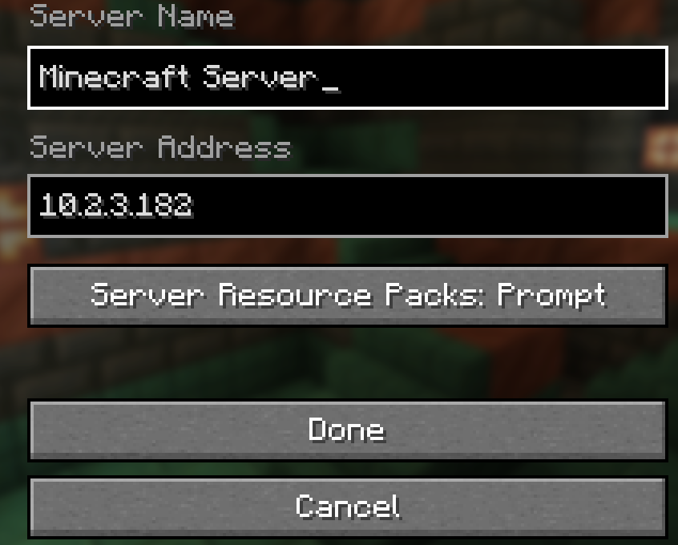
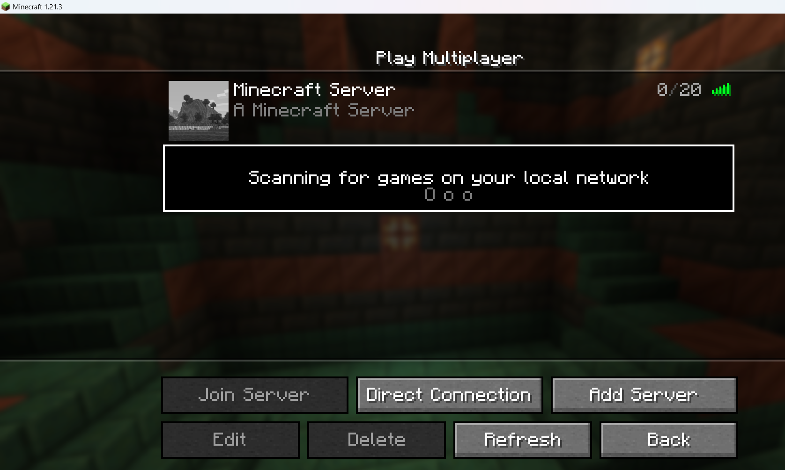

11/14
lagde en bash script til å starte serveren med "./start.sh"
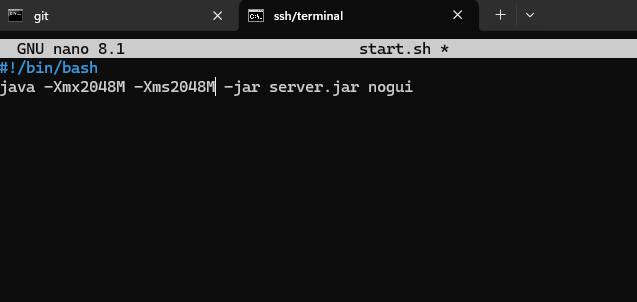

Prøver å finne ut om jeg må og om jeg trenger å installere og bruke spigot istedet
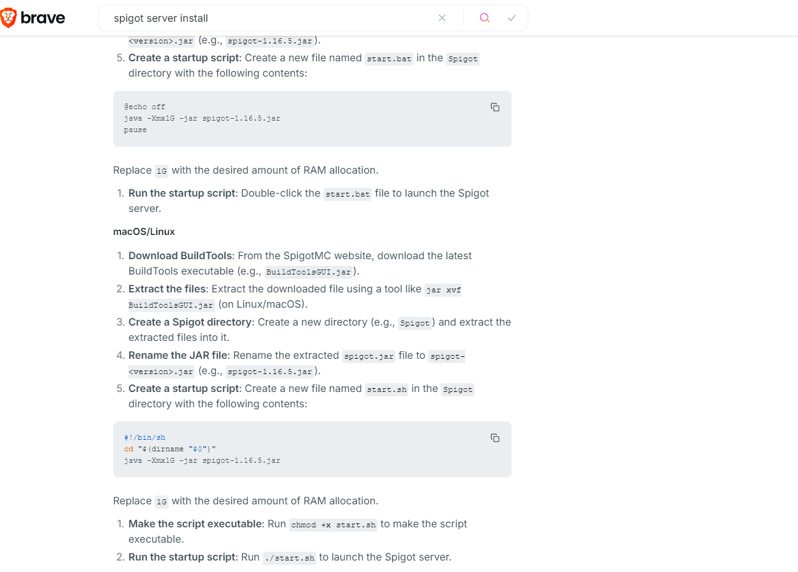
og jeg må prøve å finne ut hvordan få en dns for serveren istede for å skrive inn ip  

har også laget en ny fil.md for scripts som jeg kommer til å bruke
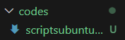

11/15
Installerer og prøver å starte en server med spigot

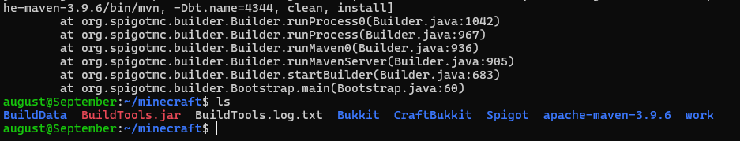

Funket ikke
skal full resette Pi og prøve på nytt pga tror noe er korrupt men usikker
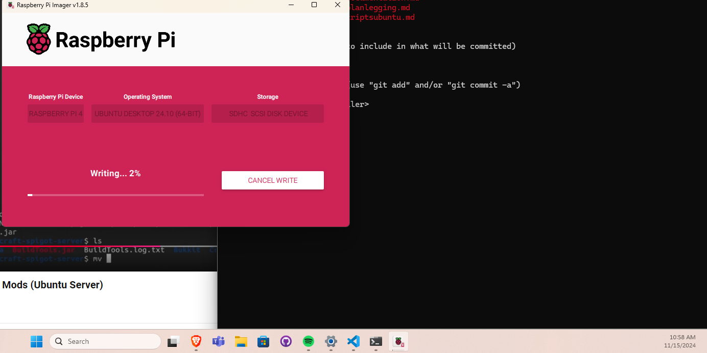
har greid å lage java server tror prinsippet er det samme
bare fucket opp et sted

Var syk noen dager, har begynt på igjen, tenker å starte på nettside.

12/3
Har startet med nettside usikker på om jeg har tid til å 
gjøre den ferdig til å lage en DB neste uke

12/10

Setter opp MariaDB på raspberry PI, 
men når jeg installerer flask går noe feil
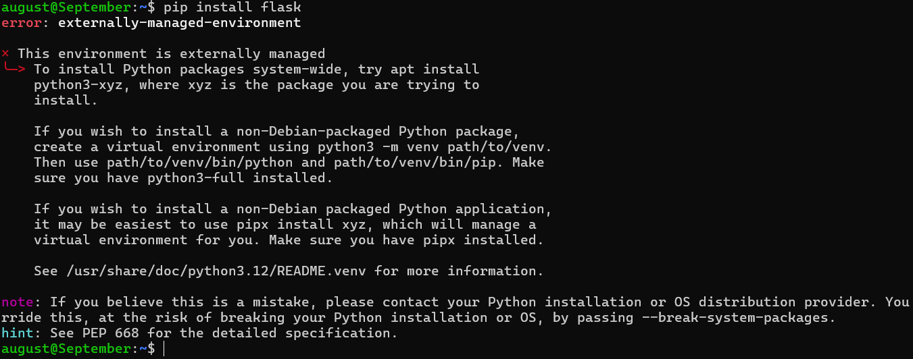

Fikset.

Installert apache.

JEG GREIDE Å HENTE PLAYER OG PLAYERLISTE OG VISE DET PÅ EN NETTSIDE

Uke 51
Alt går som nesten det skal måtte slette alt det jeg gjorde forgjegang og gjøre det på nytt. 
det jeg har nå er 
Minecraft server,
Minecraft server start script,

Directory for minecraft server nettsiden & player tracker

    Dir for templates

      nettside etc

    dir for static (css, js etc)

      css sånne filer etc

    app.py nano

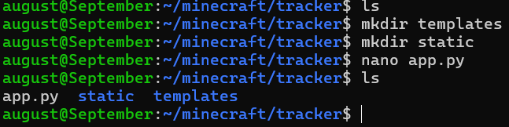

henta index filen jeg skal bruke
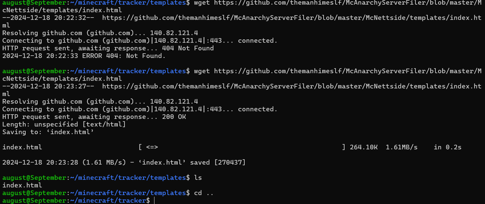

henta css filen
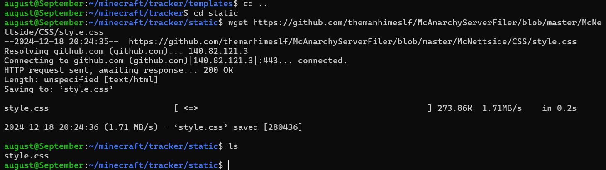

skal nå runne det, jeg må runne minecraft først og så kan jeg prøve nettsiden/tracker

fikk error melding

Jeg hadde player_data istede for player_count og så fikset jeg det
(byttet playerdata til playercount i index fil)
og nå funker det
eneste igjen er å koble til css 

fikk noen error messages, style.css ble fjernet når jeg prøvde å mv men det funket ikke så sudo mv men det funket ikke heller når jeg byttet mellom dir bare ble borte

til slutt måtte jeg lage ny i style.css i static dir
men funket ivertfall
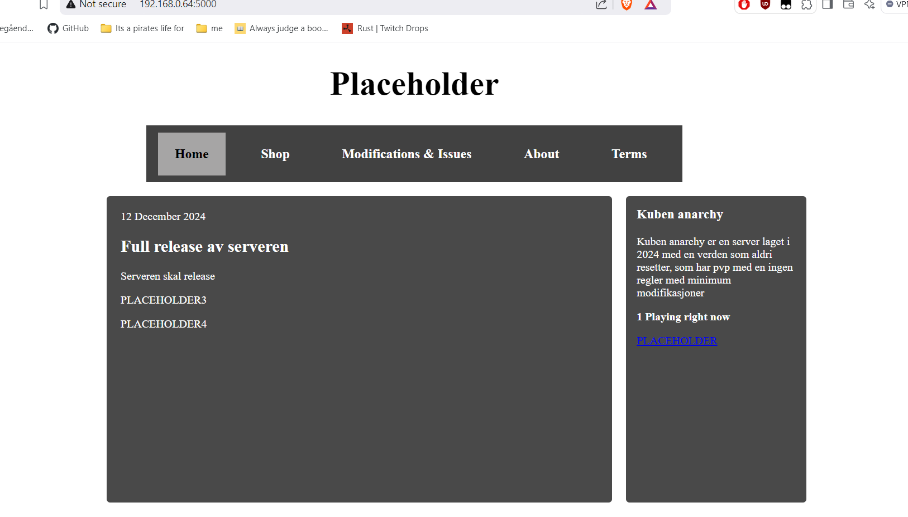
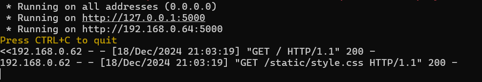
